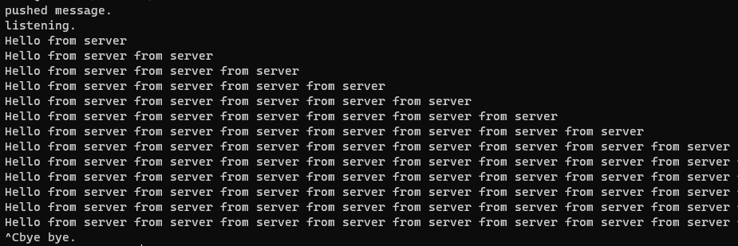

# czqm server sample



there are some examples here: https://github.com/zeromq/czmq/tree/master/examples/security

this one deals with starting a server that allows bidirectional messaging with clients

# requirements

https://zeromq.org/languages/c/

# build

```
$ make server
$ make client
```